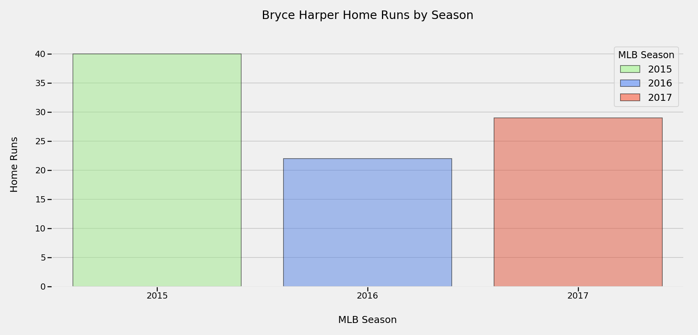
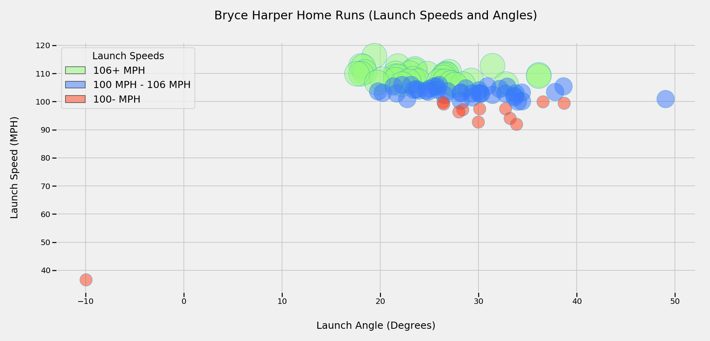
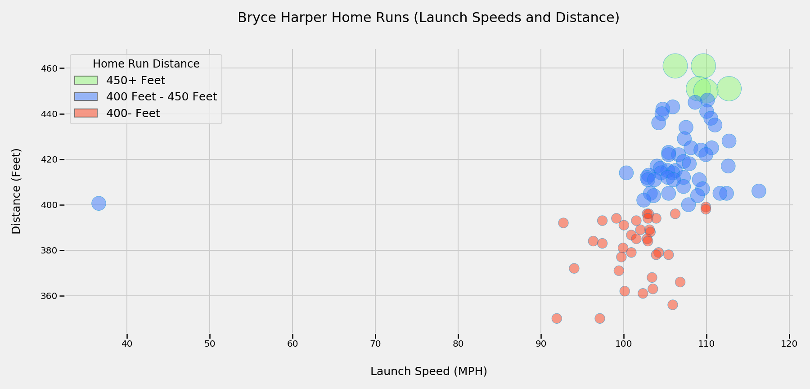
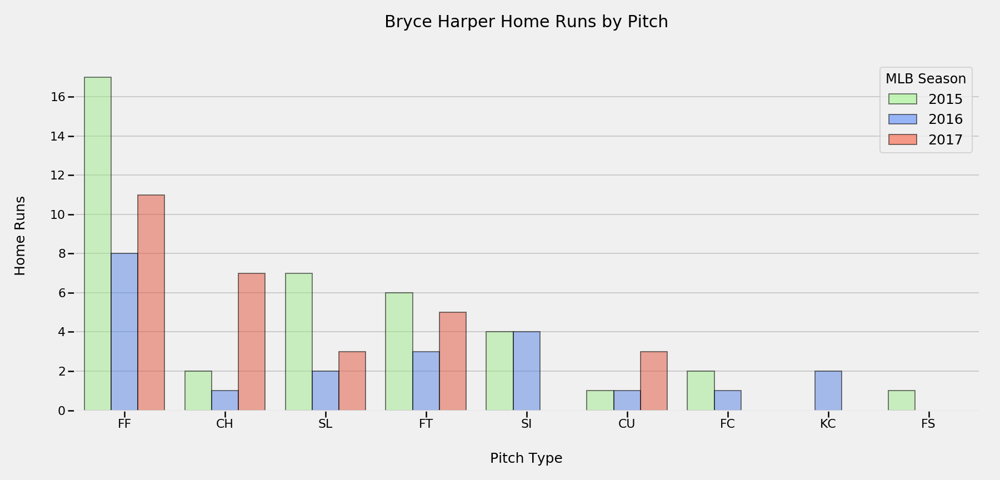
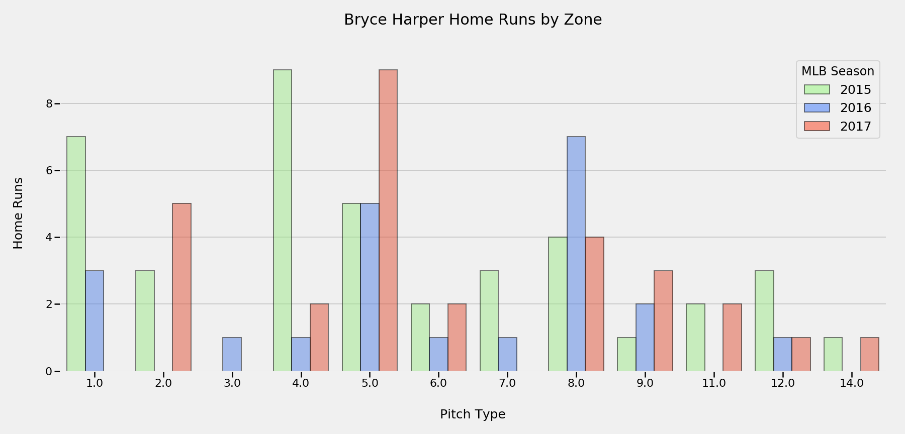
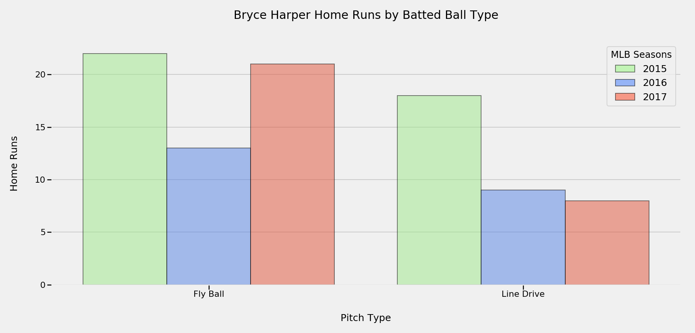
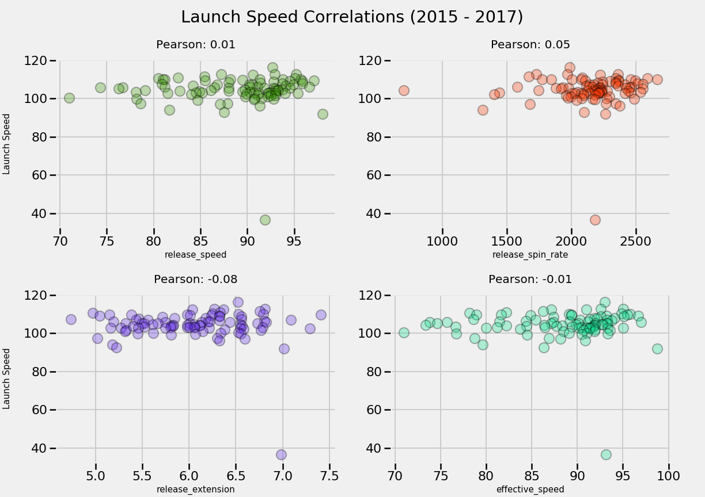

<h1 align="center">Bryce Harper Home Run Scouting Report</h1>

*Jon Nelson*

---

## Outline

- [Description](#description)
- [File Structure](#file-structure)
- [Bryce Harper Home Run Conclusions](#bryce-harper-home-run-conclusions)

---

## Description

---

In a recent capstone project that I completed I reviewed home run data from the 2015, 2016, and 2017 MLB seasons in order to analyze what was influencing the launch speeds (exit velocity) of home run hits and ultimately leading to an increase in home runs. I realized that through this project I could get even more granular in the data and review home runs by MLB divisions, leagues, teams and players. So, I decided to create a home run scouting report of the leagues best and most popular players, Bryce Harper. Using the same data from my capstone project I will analyze Harper's home run stats from the 2015, 2016 and 2017 seasons.

---

## File Structure

- <a href="notebooks">notebooks</a>
- <a href="data">data</a>
- <a href="plots">plots</a>
- [README.md](./README.md)

---

#### Capstone Project

To see the entirety of my capstone project copy and paste the below URL into a web browser
- https://github.com/datanelson518/MLB_Home_Run_Exit_Velocity

---

### Home Runs by seasons

Lets start by understanding Harper's home run production by season.

  

### Home Run Launch Speeds (Exit Velocity) and Angles

Next we can take a look at the launch speeds and angles of each home run that Harper has produced since the 2015 season.

  

#### Bryce Harper's Power

A very interesting data point in the above plot is the one outlier. On one occasion Harper hit a home run that launched from an angle of negative 9.955 degrees and left the ball park at a speed of 36.6 mph but still traveled a total of 400.58 feet.

**That's what I call power!**

| MLB Season | Exit Velocity | Launch Angle | Distance |
|------------|---------------|--------------|----------|
|    2015    |   36.6 mph    |- 9.955 degrees|  400.58 |

### Home Run distances

We can also take a look at the distance of each home run that Harper hit since the 2015 season.

  

### Home Runs by Pitch Type

Lets take a look at the pitches that Harper produces his most home runs from and specifically take a look at this by season.

- `pitch_type`: The type of pitch that was thrown and hit for a home run
    - `CH` : `Changeup`
    - `CU` : `Curveball`
    - `EP` : `Eephus`
    - `FC` : `Cut Fastball (Cutter)`
    - `FF` : `Four-seam Fastball`
    - `FO` : `Pitch Out`
    - `FS` : `Sinking Fastball / Split-Fingered (Splitter)`
    - `FT` : `Two-seam Fastball`
    - `KC` : `Knuckle-curve`
    - `KN` : `Knuckleball`
    - `SC` : `Screwball`
    - `SI` : `Sinker`
    - `SL` : `Slider`

  

### Home Runs by Zone

We can also analyze which part of the of the zone Harper is hitting his home runs and again take a look at this by season.

  

### Home Runs by Batted Ball Type

Another great recorded statistic is the home run batted ball type. We can analyze each of Harper's home runs as either Fly Ball or Line Drive home runs.

**Batted Ball Type by Launch Angle**

| Ground Ball | Line Drive | Fly Ball | Pop Up |
|-------------|------------|----------|--------|
| Less than 10 degrees | 10-25 degrees | 25-50 degrees | Greater than 50 degrees |

  

### Home Run Launch Speed (Exit Velocity) Correlations to various Pitch stats

Now I am going to get a little more statistical on you and analyze Harper's correlations against some specific pitch statistics.

**Pitch Stats:**
- `Release Speed`: the (perceived) speed of the pitch upon release from the pitcher
- `Release Spin Rate`: how much spin, in revolutions per minute, a pitch was thrown with upon release.
- `Release Extension`: how far off the mound, in feet, a pitcher releases the pitch.
- `Effective Speed`: the (actual) speed of the pitch upon the ball crossing home plate

1. Release Speed:
    - A weak positive correlation. Meaning that as the release speed of the pitch increases so will the exit velocity of Harper's home runs. It's a very low correlation meaning that this stat against velocity is not going to provide a whole lot of valuable insight into exit velocity.
2. Release Spin Rate:
    - A weak postive correlation. Meaning that as the release spin rate of the pitch increase so the the exit velocity of Harper's home runs. It's larger than the Release Speed correlation but still quite low and won't provide very much value into the exit velocity.
3. Release Extension:
    - A weak negative correlation. Meaning that as the release extension of the pitch increases the exit velocity of Harper's home runs will decrease. Still a low value but it's the strongest correlation value of the previous two thus far but will still not provide very much value into the exit velocity.
4. Effective Speed:
    - A weak negative correlation. Meaning that as the effective speed of the pitch increases the exit velocity of Harper's home runs will decrease. Another very low value meaning we won't be able to draw valuable insights into the exit velocity (at this point).

##### Overall Interpretation

Even though the below pitch stats are all showing weak correlations to the target stat (exit velocity) it's still worth examining to understand if/where the strengths are in the data.

  

---

## Bryce Harper Home Run Conclusions

There you have it an in depth review of each home run that Harper has hit since the 2015 season. What is interesting to me about this data is players and coaching staffs can use this information to better prepare for playing against Bryce Harper and vice versa Bryce Harper can use this data to see where he likes pitches by various tracked data points and train himself to look for these specifics when at bat. On top of all of this there are obvious things that both pitcher and batter will not be able to control but for the data people like me we can review interesting statistics that lead to higher exit velocities, launch angles, hit distances, and etc.
